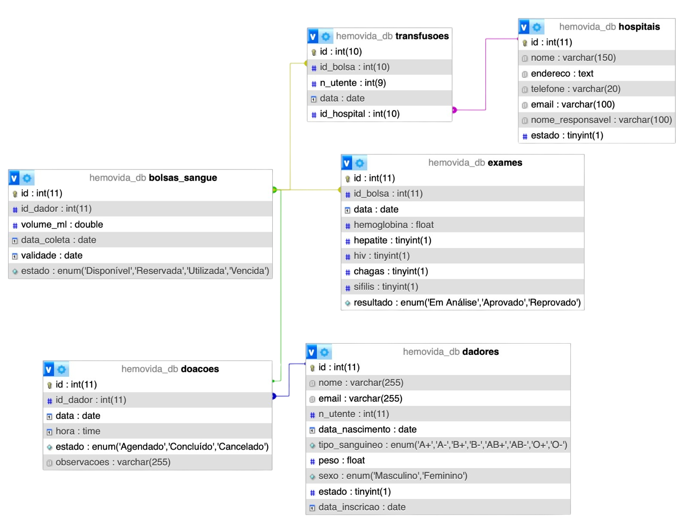

# HemoVida - Centro de Doações de Sangue

<p align="center">
  
</p>

Este projeto é um sistema de gestão de doações de sangue desenvolvido com as tecnologias PHP e Bootstrap, mas com ênfase em SQL.

O SQL foi a tecnologia central deste projeto, sendo utilizado para estruturar e organizar a base de dados, garantindo a integridade e a acessibilidade das informações. Através de consultas SQL, foi possível criar páginas dinâmicas, realizar atualizações em tempo real e fazer a gestão das interações entre as diversas funcionalidades da plataforma. O SQL foi fundamental para a construção das tabelas, a definição de relacionamentos e a execução de operações de consulta e manipulação de dados.

## 📌 Funcionalidades

- Acompanhamento dos dadores de sangue;
- Gestão da agenda de doações;
- Controlo das bolsas de sangue;
- Supervisão do estado dos exames clínicos efetuados;
- Gestão de transfusões de sangue realizadas;
- Gestão das parcerias com os hospitais.

## 💻 Instalação

1. Clone o repositório:
```
git clone https://github.com/babisobrinho/hemovida.git
cd hemovida
```

2. Configure a Base de Dados

O projeto depende de uma base de dados para armazenar informações sobre os dadores, doações, bolsas de sangue, transfusões, etc.
- Crie uma base de dados no MySQL com o nome hemovida (ou outro nome, se preferir)
- Importe o script de criação de tabelas contido no ficheiro `sql/setup.sql` na sua nova base de dados

3. Iniciar o Servidor Web

Caso esteja a usar o XAMPP ou MAMP, inicie os servidores Apache e MySQL:
- No XAMPP, abra o painel de controlo e clique em "Start" para o Apache e MySQL
- No MAMP, clique em "Iniciar Servidores"

4. Aceda à plataforma:
```
http://localhost/hemovida/
```

## 🛠 Estrutura do Projeto
```
/hemovida
├── assets/                 # Ficheiros estáticos como CSS, JS, imagens
│   ├── css/                # Ficheiros CSS
│   ├── js/                 # Ficheiros JavaScript
│   └── images/             # Imagens usadas no site
│
├── includes/               # Ficheiros PHP que são incluídos nas páginas
│   ├── db_connection.php   # Conexão com a base de dados
│   ├── db_functions.php    # Funções que fazem consultas à base de dados
│   ├── destroy.php         # Remove registos da base de dados
│   ├── store.php           # Cria registos na base de dados
│   └── update.php          # Atualiza registos da base de dados
│
├── partials/               # Ficheiros PHP que são parte do layout das páginas
│   ├── footer.php          # Rodapé comum para todas as páginas
│   └── header.php          # Cabeçalho comum para todas as páginas
│   └── page-header.php     # Título e breadcrumb comum para algumas páginas
│   └── scripts.php         # Scripts comuns para todas as páginas
│
├── sql/                    # Scripts SQL
│   └── setup.sql           # Script para a criação da base de dados e das tabelas
│
├── config/                 # Configurações gerais do projeto
│   └── config.php          # Configurações do sistema
│
├── index.php               # Página inicial / Dashboard
├── bolsas_sangue.php       # Página de inventário de bolsas de sangue
├── dadores.php             # Página de gestão de doadores
├── doacoes.php             # Página de agenda de doações
├── exames.php              # Página de exames realizados ao sangue
├── hospitais.php           # Página de hospitais parceiros
├── transfusoes.php         # Página de transfusões de sangue realizadas
├── sobre.php               # Página que explica sobre o que é o projeto
│
├── README.md               # Ficheiro com as informações sobre o projeto
│
└── .gitignore              # Ficheiro para ignorar o que não deve ser versionado

```

## 🛢️ Base de Dados

  <p align="center">
    
  </p>

  A base de dados do projeto HemoVida foi projetada para gerir o processo de doação e transfusão de sangue de forma eficiente. Ela é composta por diversas tabelas interligadas que armazenam e organizam informações sobre doadores, doações, bolsas de sangue, transfusões e exames médicos.

### 📁 Principais Entidades

- `dadores`: contém as informações pessoais dos dodores de sangue, como nome, e-mail, número único de utente, tipo sanguíneo, peso, sexo, estado e data de inscrição
- `doacoes`: controla as marcações feitas para doação de sangue, associando cada doação a um dador. Regista a data, hora, o estado da doação e observações adicionais
- `bolsas_sangue`: controla o inventário de bolsas de sangue coletadas, associando cada uma a um dador. Regista o volume de sangue, a data de coleta, a data de validade e o estado
- `exames`: contém os exames médicos realizados nas bolsas de sangue. Regista os níveis de hemoglobina e os resultados de testes para doenças como hepatite, HIV, chagas e sífilis. Por fim, também registado o resultado do exame
- `hospitais`: contém as informações sobre os hospitais parceiros. Regista o nome, endereço, contato e o nome do responsável do hospital
- `transfusoes`: relaciona as bolsas de sangue a pacientes que recebem transfusões nos hospitais. Regista o ID da bolsa de sangue, o número único de utente do receptor, a data da transfusão e o hospital onde foi realizada

### 🔗 Relacionamentos

- `dadores` ↔ `doacoes`: um doador pode realizar várias doações
- `doacoes` ↔ `bolsas_sangue`: cada doação pode gerar uma ou mais bolsas de sangue
- `bolsas_sangue` ↔ `exames`: todas as bolsas são submetidas a exames antes de serem utilizadas
- `bolsas_sangue` ↔ `transfusoes`: apenas as bolsas aprovadas podem ser utilizadas para transfusões
- `transfusoes` ↔ `hospitais`: as transfusões são realizadas em hospitais registados como parceiros

## ⚙ Tecnologias Utilizadas

- PHP 8+
- MySQL 8+
- HTML5
- Bootstrap 5+

## 📄 Licença

Este projeto está sob a licença MIT.

## 👩🏻‍💻 Créditos

Desenvolvido por [Babi Sobrinho](https://github.com/babisobrinho), [Lenice Soares](https://github.com/lenicesoaares), [Rebeca Santos](https://github.com/RebecaSantosb), [Juliana Alves](https://github.com/JulyDuds) e [Aline Armando](https://github.com/kiamy6) no âmbito da UFCD "5085 - Criação de estrutura de base de dados em SQL" do CET Tecnologias e Programação de Sistemas Informáticos.